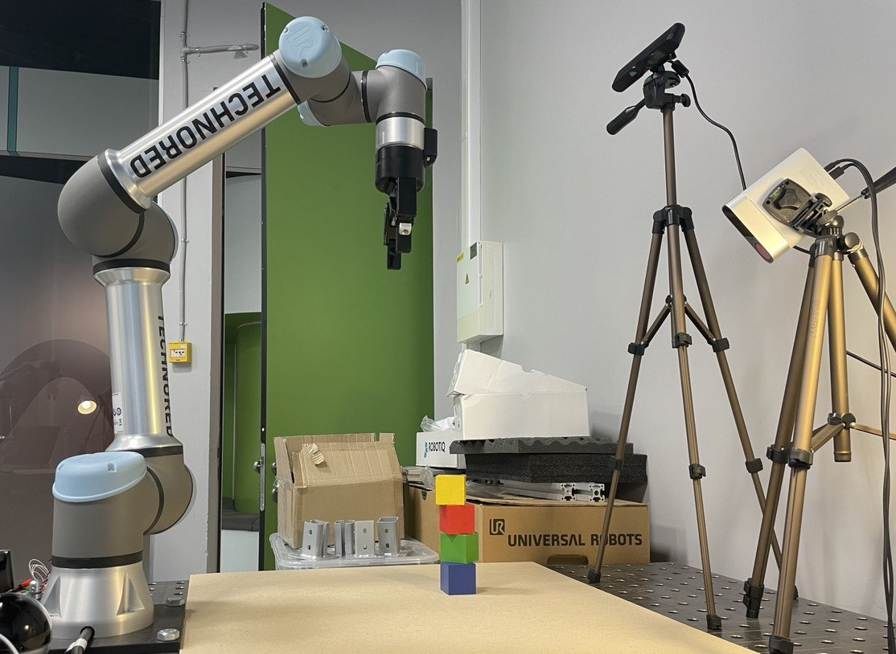

# spot_docker
The Docker image contains a learning algorithm and robot framework called SPOT, which is part of the [Good Robot Project](https://github.com/jhu-lcsr/good_robot). More information on the Good Robot project and the SPOT framework can be found at this [link](https://github.com/jhu-lcsr/good_robot). 

## Key points

* We created Docker image with SPOT framework [v0.17.1](https://github.com/jhu-lcsr/good_robot/archive/refs/tags/v0.17.1.zip), and separate folder with the SPOT framework customized for our infrastructure
* Using this Docker image, you can quickly create, run and test your own Docker container with the SPOT framework
* It is also possible to run a Docker container on different cloud virtual machines

We deployed and tested the SPOT framework in our infrastructure using [UR5e robot](https://www.universal-robots.com/products/ur5-robot/) and ASUS Xtion Pro Live RGB-D camera. 

<!-- GETTING STARTED -->
## Getting Started

To get a local copy up and running, follow these steps.

### Prerequisites

* The container is based on Docker, so you need to [install Docker](https://docs.docker.com/engine/install/ubuntu/) first.
  
### Installation

1. Clone the repo
   ```sh
   git clone https://github.com/AnatoliyZabrovskiy/spot_docker.git
   ```

2. Change directory
   ```sh
   cd spot_docker/
   ```
   
3. Build Docker image
   ```sh
   sudo docker build -t good-robot-ubuntu18.04:v08 .
   ```
      
4. Run Docker container
   ```sh
   sudo docker run --privileged -p 6080:80 -p 50002:50002 -p 50003:50003 -p 30002:30002 -p 63352:63352 --name good-robot -e HTTP_PASSWORD=goodRobotPassword --rm -ti -e RESOLUTION=1600x900 good-robot-ubuntu18.04:v08
   ```

4. Connecting to the Docker OS
   
To connect and see a desktop of an operating system (Ubuntu 18.04) of a Docker container, you can use Google Chrome browser and open the following URL: [http://127.0.0.1:6080/](http://127.0.0.1:6080/). You will be asked to enter **login** and **password**, which are **root** and **goodRobotPassword**, respectively. 

The default version of SPOT framework is in the container folder **_/root/good-robot/good_robot-0.17.1_default_** (copied from [here](https://github.com/jhu-lcsr/good_robot/archive/refs/tags/v0.17.1.zip)). Our customized version of the SPOT framework is in the folder **_/root/good-robot/good_robot-0.17.1_** (the same on Github in the archive ./files/good_robot-0.17.1-rqc.tar).

<p align="center">
  
</p>

<!-- GETTING STARTED -->
## Getting Started: How We Run SPOT framework on Our Infrastructure with the UR5e Robot

### 1. Lab Server

Our ASUS Xtion Pro Live RGB-D camera is connected via USB to the Lab server (Ubuntu 20.04, IP: 192.168.1.136), where we use camera ROS driver to obtain images and depth estimates from the camera. In order to have the various ROS commands available from command line, we source the **setup.bash** of our ROS installation. This file is stored at /opt/ros/**ros-distro**/setup.bash where **ros-distro** is replaced by the name of the ROS distribution we are using.

   ```sh
   source /opt/ros/noetic/setup.bash
   ```

then we export [ROS_MASTER_URI](https://wiki.ros.org/ROS/EnvironmentVariables) environment variable that tells a ROS Node where the ROS Master is. In our case the Lab Server is a ROS Master!

   ```sh
   export ROS_MASTER_URI=http://192.168.1.136:11311
   ```

For the Xtion PRO Live camera we execute the following command:
   ```sh
   roslaunch openni2_launch openni2.launch depth_registration:=true
   ```

This step can be skipped: In addition to reducing the frequency of publishing topics (RGB and Depth), we use the **_cam_ros_publish.py_** script and the following commands:
   ```sh
  source ./venv/bin/activate
  source /opt/ros/noetic/setup.bash
  python3 cam_ros_publish.py
   ```

### 2. Cloud Virtual Machine (VM) 

We connect our Yandex Cloud VM to the Lab network using a VPN (SSTP VPN in our case). We utilize **_sstpc_** VPN client and running the following command on the VM:

   ```sh
  sudo sstpc --cert-warn --tls-ext --user <USER_NAME> --password <PASSWORD> <VPN_SERVER_ADDRESS> usepeerdns require-mschap-v2 noauth noipdefault noccp refuse-pap refuse-eap refuse-chap refuse-mschap --log-stderr --log-level 4
   ```
On the VM in the cloud, we have an NVIDIA Tesla V100 card which is used by the algorithm. If you also decide to use a VPN, you will need to set up your own VPN server. Remember to define **USERNAME**, **PASSWORD**, and **VPN_SERVER_ADDRESS** for  **_sstpc_** VPN client. In our case, the VM receive an IP address of **_192.168.0.100_** from the VPN server. Also a new route on the VM instance was added to allow network access from the VM to the robot (IP=192.168.1.179) and the Lab Server (IP=192.168.1.136).

   ```sh
  sudo ip route add 192.168.1.0/24 via 192.168.1.1
   ```
Now, the VM should have connectivity with the Robot and the Lab Server. Try pinging the Lab Server and/or Robot from the cloud VM.

   ```sh
  ping 192.168.1.179
  ping 192.168.1.136
   ```

Now let's start the Docker container on a VM instance. The Docker image we use is located in our Yandex Container Registry. However, it's also possible to use a local version of the Docker image.

For a local Docker image:

   ```sh
sudo docker run --privileged -p 6080:80 -p 50002:50002 -p 50003:50003 -p 192.168.1.100:30002:30002 -p 192.168.1.100:63352:63352 -p 192.168.1.100:11311:11311 --name good-robot -e HTTP_PASSWORD=goodRobotPassword --rm -ti -e RESOLUTION=1600x900 good-robot-ubuntu18.04:v08
   ```

For the Docker image located in the cloud registry:

   ```sh
sudo docker run --privileged -p 6080:80 -p 50002:50002 -p 50003:50003 -p 192.168.1.100:30002:30002 -p 192.168.1.100:63352:63352 -p 192.168.1.100:11311:11311 --name good-robot -e HTTP_PASSWORD=goodRobotPassword --rm -ti -e RESOLUTION=1600x900 cr.yandex/crppjen8sto7ua2il13b/good-robot-ubuntu18.04:v08
   ```

To connect and see a desktop of an operating system (Ubuntu 18.04) of a Docker container, you can use the Google Chrome browser and the following URL: [http://127.0.0.1:6080/](http://127.0.0.1:6080/).

Use **login** **root** and **password** **_goodRobotPassword_** to access the container OS.

### 3. Docker container

After getting access to the Desktop of the Docker Container OS (Ubuntu 18.04), you need to open two terminal windows.

### Terminal 1
Let's first export ROS_MASTER_URI environment variable. The [ROS_MASTER_URI](https://wiki.ros.org/ROS/EnvironmentVariables).

```sh
export ROS_MASTER_URI=http://192.168.1.136:11311

 ```

We use [**_rostopic list_**](https://wiki.ros.org/ROS/Tutorials/UnderstandingTopics#Using_rostopic_list) command to return a list of all topics currently subscribed to and published (see figure below).


```sh
source /opt/ros/melodic/setup.bash
rostopic list
 ```

<p align="center">
  
</p>

Next, we make the workspace visible to ROS (source the setup file in the **install_isolated** directory). Additionally, we activate the Python environment and change the current directory of the terminal.

```sh
source /home/ros/ros_catkin_ws/install_isolated/setup.bash
source /home/ubuntu/good-robot/venv/bin/activate
cd /home/ubuntu/good-robot/good_robot-0.17.1
 ```

Now we can run the SPOT framework inside a container to test a [model](https://github.com/jhu-lcsr/good_robot/releases) that has already been trained and provided by the author. 

```sh
export CUDA_VISIBLE_DEVICES="0" && python3 main.py \
--tcp_host_ip 192.168.1.179 \
--tcp_port 30002 \
--num_obj 4  \
--push_rewards \
--experience_replay \
--explore_rate_decay \
--trial_reward \
--common_sense \
--check_z_height \
--place \
--future_reward_discount 0.65 \
--is_testing \
--random_seed 1238 \
--max_test_trials 10 \
--save_visualizations \
--random_actions \
--snapshot_file ../models/2020-05-13-12-51-39_Sim-Stack-SPOT-Trial-Reward-Masked-Training-simtoreal-model/snapshot.reinforcement_action_efficiency_best_value.pth
 ```

### Terminal 2

To stop the main.py script that was launched in Terminal 1, open a second terminal window and execute the following command:

```sh
sudo pkill -9 -f main.py
 ```

## Results
SPOT algorithm running on our infrastructure.

<p align="center">
  
</p>

<p align="center">
  
</p>

## Acknowledgments


   
